<div align="center">

<!-- Animated wave header -->


<!-- Animated typing banner -->
<a href="#">
  
</a>

<br/>


<br/>


</div>

---

<div align="center">

## 🌊 What is Pravah.ai?

</div>

> **Pravah** *(Sanskrit: प्रवाह — "flow")* — because critical engineering context should *flow*, not vanish in a Slack thread.

Engineering teams **bleed time** searching through:
- 🧵 Endless Slack threads
- 📋 Unstructured standups  
- 💬 Long chat discussions with buried decisions

**Pravah.ai** plugs directly into those conversations and automatically produces a clean, structured JSON handoff — instantly.

<div align="center">

| ✅ Tasks | 👤 Owners | 🚧 Blockers | ⏰ Deadlines | 🗳 Decisions | 🔗 Dependencies |
|:---:|:---:|:---:|:---:|:---:|:---:|
| Extracted | Assigned | Surfaced | Tracked | Logged | Mapped |

</div>

---

## ✨ Features

<table>
<tr>
<td width="50%">

### 🧠 LLM Extraction
Uses **OpenRouter** to intelligently parse tasks, blockers, owners, and deadlines from raw unstructured chat. No regex hacks — actual language understanding.

</td>
<td width="50%">

### 🛡️ Rule-Based Fallback
If the LLM fails or no API key is present, a deterministic rule-based parser takes over — **always returning schema-safe JSON**. Zero silent failures.

</td>
</tr>
<tr>
<td width="50%">

### 💬 Slack Integration
Pravah connects natively to Slack. Engineering conversations turn into structured handoffs without any manual copy-paste or summarization.

</td>
<td width="50%">

### 🤖 Chat QA Agent
Interrogate your handoff object conversationally via the `/chat` endpoint. Ask *"who owns the payment retry?"* — get a direct answer.

</td>
</tr>
<tr>
<td width="50%">

### ⚡ Machine-Ready JSON
Output is always automation-ready. Pipe it into Jira, Linear, Notion, or your own tooling — structured handoffs become first-class data.

</td>
<td width="50%">

### 🧪 Unit Tested Logic
Extraction logic is covered by unit tests using Node's native `node:test` runner. Ship with confidence across edge cases.

</td>
</tr>
</table>

---

## 🏗️ Agent System Architecture

> Animated data packets flow across every agent boundary in real-time. Place `architecture.svg` in the same folder as this README.

<div align="center">

</div>

<br/>

**Pipeline summary:**

```
💬 Raw chat messages
    └─▶ 🚀 Express API receives & routes request
            └─▶ 🤖 Pravah Orchestrator (AI Agent Hub)
                    ├─▶ 🧠 LLM Agent       (primary path)  ─▶ ┐
                    └─▶ 🛡️ Rule Parser     (fallback path) ─▶ ┤
                                                               └─▶ 📦 Structuring Engine
                                                                           └─▶ 📊 Handoff JSON
                                                                                     └─▶ 💡 /chat QA Agent
```

---

## 📦 Input → Output

**Input** — raw conversation messages:

```json
[
  "Rahul is working on retry logic for checkout service",
  "Payment API timeout is blocking deployment",
  "Fix by tonight"
]
```

**Output** — structured engineering handoff:

```json
{
  "tasks":        ["Rahul is working on retry logic for checkout service"],
  "blockers":     ["Payment API timeout is blocking deployment"],
  "owners":       ["Rahul → retry logic for checkout service"],
  "deadlines":    ["Fix by tonight"],
  "decisions":    [],
  "dependencies": []
}
```

> ✅ Always schema-safe. Always machine-readable. Always pipe-able.

---

## ⚙️ API Endpoints

| Method | Endpoint | Description |
|--------|----------|-------------|
| `GET` | `/health` | Health check — confirm the server is live |
| `POST` | `/handoff/extract` | Submit messages, receive structured handoff JSON |
| `POST` | `/chat` | Query your handoff object conversationally |

<details>
<summary><b>📖 Example: POST /handoff/extract</b></summary>

**Request:**
```bash
curl -X POST http://localhost:3000/handoff/extract \
  -H "Content-Type: application/json" \
  -d '{
    "messages": [
      "Priya is fixing the auth token bug",
      "DB migration is blocking the release",
      "Deadline is end of sprint"
    ]
  }'
```

**Response:**
```json
{
  "tasks":        ["Priya is fixing the auth token bug"],
  "blockers":     ["DB migration is blocking the release"],
  "owners":       ["Priya → auth token bug"],
  "deadlines":    ["End of sprint"],
  "decisions":    [],
  "dependencies": ["DB migration"]
}
```
</details>

<details>
<summary><b>📖 Example: POST /chat</b></summary>

**Request:**
```bash
curl -X POST http://localhost:3000/chat \
  -H "Content-Type: application/json" \
  -d '{
    "handoff": { "..." },
    "question": "Who owns the auth bug?"
  }'
```

**Response:**
```json
{ "answer": "Priya owns the auth token bug fix." }
```
</details>

---

## 🛡️ Reliability Design

```
          LLM Available?
               │
        ┌──────┴──────┐
        YES           NO
        │              │
        ▼              ▼
   LLM Extract    Rule Parser
        │              │
        └──────┬────────┘
               ▼
        Schema Validation
               │
               ▼
        ✅ Safe JSON Output
          (always returned)
```

Pravah never crashes silently. The fallback parser guarantees output regardless of API availability, key errors, or LLM timeouts.

---

## 🚀 Quick Start

**1. Clone & install**
```bash
git clone https://github.com/your-org/Pravah-ai.git
cd Pravah-ai
npm install
```

**2. Configure environment**
```bash
cp .env.example .env
```
```env
OPENROUTER_API_KEY=your_key_here
PORT=3000
```

**3. Start the server**
```bash
node src/server.js
```

**4. Run tests**
```bash
node --test
```

---

## 📂 Project Structure

```
Pravah.ai/
│
├── 📁 landing page/
│   └── index.html
│
├── 📁 src/
│   ├── server.js               # Express API server
│   └── extractHandoff.js       # LLM + fallback extraction logic
│
├── 📁 test/
│   └── extractHandoff.test.js  # Unit tests
│
├── architecture.svg            # 🔥 Animated agent architecture diagram
├── .env.example
└── README.md
```

---

## 👥 Contributors

<table>
<tr>
  <td align="center"><b>Lavansh Choubey</b><br/><sub>Co-creator</sub></td>
  <td align="center"><b>Aksh Garg</b><br/><sub>Co-creator</sub></td>
</tr>
</table>

---

<div align="center">


**If Pravah saves your team from lost context, leave a ⭐**

*Built with care for engineering teams everywhere.*

</div>
