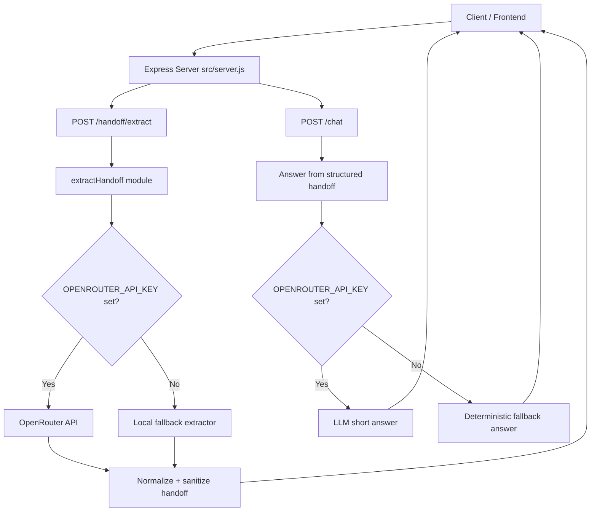

# PRAVAH.ai

PRAVAH.ai converts conversation messages into a structured, actionable handoff JSON for engineering teams. It also supports question answering on top of the extracted handoff.

The project includes:
- An Express API server for extraction and Q&A
- A robust extraction module with OpenRouter + local fallback
- Unit tests for extraction behavior
- A separate marketing landing page

## What It Solves

Given raw chat-like messages, PRAVAH.ai produces this schema:

```json
{
  "blockers": [],
  "tasks": [],
  "owners": [],
  "deadlines": [],
  "decisions": [],
  "dependencies": []
}
```

This enables cleaner shift handoffs, async status updates, and downstream automation.

## Project Structure

```text
PRAVAH.ai/
  landing page/
    index.html                 # Static landing page
  src/
    extractHandoff.js          # Core extraction logic (LLM + local fallback)
    server.js                  # Express API server and chat endpoint
  test/
    extractHandoff.test.js     # Unit tests (node:test)
  .env                         # Local secrets (ignored by git)
  .env.example                 # Environment template
  .gitignore
  README.md
```

## Architecture

### High-level components
1. API Layer (`src/server.js`)
2. Extraction Engine (`src/extractHandoff.js`)
3. Test Layer (`test/extractHandoff.test.js`)
4. Static UI Layer (`landing page/index.html`)

### Runtime flow
1. Client sends messages to `POST /handoff/extract`.
2. Server validates input and calls `extractHandoff(messages)`.
3. Extractor does one of the following:
   - Uses OpenRouter (if `OPENROUTER_API_KEY` is present)
   - Uses deterministic local keyword extraction fallback
4. Server sanitizes final output and returns schema-safe JSON.
5. Client can ask follow-up question via `POST /chat` with `{ question, handoff }`.
6. Chat answer uses OpenRouter if key exists, otherwise deterministic answer from structured handoff.

### Architecture diagram



## Environment Variables

Create your own `.env` file in the project root using `.env.example` as template.

Required/optional variables:
- `OPENROUTER_API_KEY` (optional but recommended): enables LLM extraction and chat responses.
- `PORT` (optional): server port, defaults to `3000`.

Example:

```bash
PORT=3000
OPENROUTER_API_KEY=your_openrouter_api_key_here
```

If `OPENROUTER_API_KEY` is missing, the application still works with rule-based fallback extraction.

## API Endpoints

### `GET /health`
Returns service health.

Response:

```json
{ "status": "ok" }
```

### `POST /handoff/extract`
Extracts structured handoff from message list.

Request body:

```json
{
  "messages": [
    "Rahul is working on retry logic for checkout service",
    "Payment API timeout is blocking deployment",
    "Fix by tonight"
  ]
}
```

Success response:

```json
{
  "blockers": ["Payment API timeout is blocking deployment"],
  "tasks": ["Rahul is working on retry logic for checkout service"],
  "owners": ["Rahul -> retry logic for checkout service"],
  "deadlines": ["Fix by tonight"],
  "decisions": [],
  "dependencies": []
}
```

### `POST /chat`
Answers a specific question using a previously extracted handoff object.

Request body:

```json
{
  "question": "Who owns this task?",
  "handoff": {
    "blockers": [],
    "tasks": ["Implement retry logic"],
    "owners": ["Rahul -> retry logic"],
    "deadlines": [],
    "decisions": [],
    "dependencies": []
  }
}
```

Response:

```json
{ "answer": "Rahul -> retry logic" }
```

## Local Development

### 1) Install dependencies

```bash
npm install
```

Expected runtime dependencies from source:
- `express`
- `axios`
- `dotenv`

### 2) Configure environment

```bash
cp .env.example .env
# edit .env and add your OPENROUTER_API_KEY
```

### 3) Start server

```bash
node src/server.js
```

Server default URL:
- `http://localhost:3000`

### 4) Run tests

```bash
node --test
```

## Reliability and Fallback Design

- Extraction always returns a schema-safe object.
- If OpenRouter fails, parser fails, or key is missing, local fallback logic is used.
- `/chat` falls back to deterministic, category-based answering when LLM is unavailable.

## Security Notes

- Never commit `.env`.
- Rotate API keys if exposed.
- Consider adding rate limiting and request size limits in production.

## Future Improvements

- Add request validation library (for example `zod` or `joi`) for strict schema validation.
- Add integration tests for API endpoints.
- Add Docker support and deployment docs.
- Add frontend app that consumes `/handoff/extract` and `/chat` endpoints directly.
